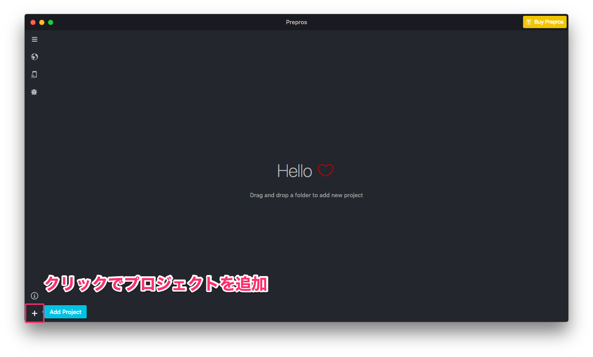
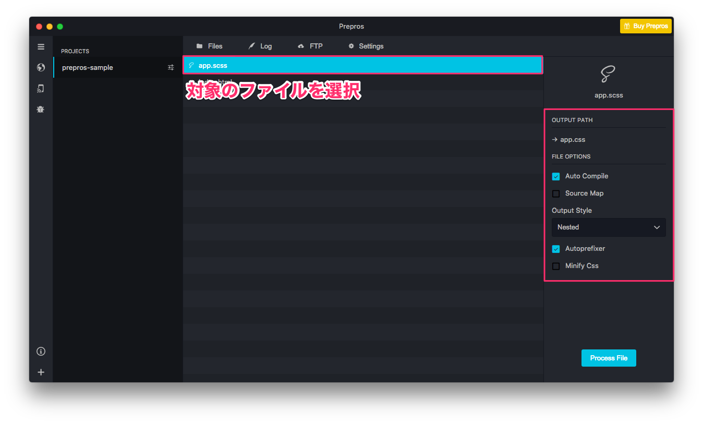
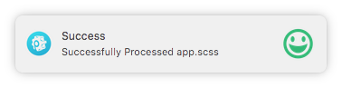
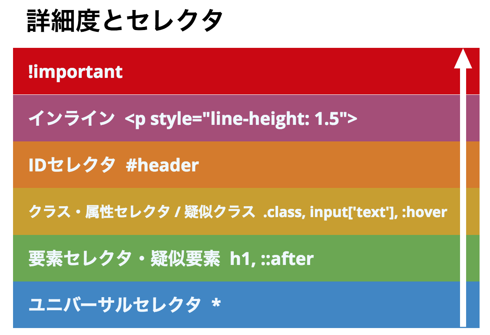
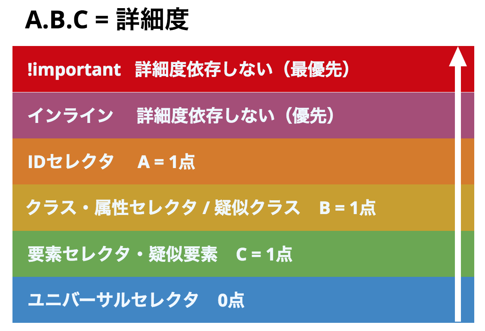
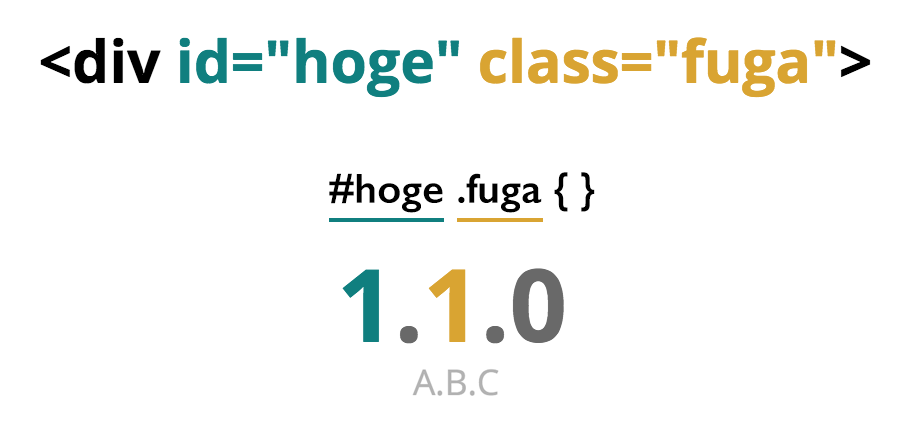
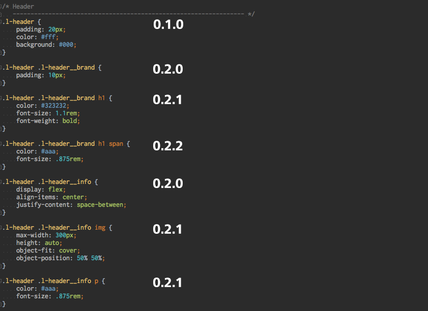
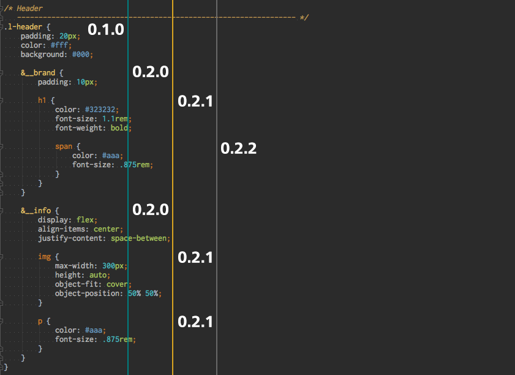
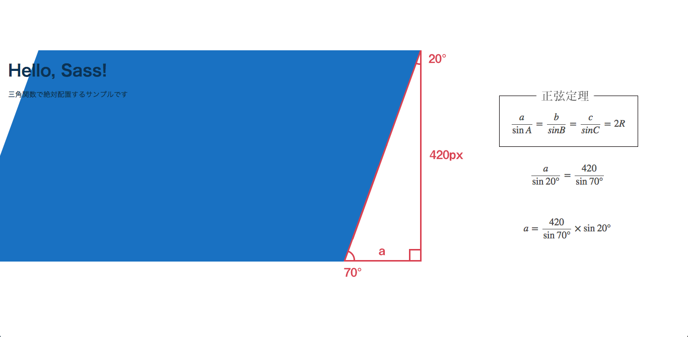

## 今からでも遅くない<br>Sass入門 + 実践mixin

2018/5/9

[第2回オトナの技術共有会@未来会議室](https://otona.connpass.com/event/86257/)<!--- .element target="_blank" -->

---

### ABOUT


- 内田 純平（27歳）
- フリーランス
- Webデザイン/Laravel/Vue.js

---


---

# Sass

- Syntactically Awesome Stylesheets
- CSSを機能拡張するメタ言語
- Ruby Sass, libsass（C/C++）
- コンパイルが必要

---

## 「.sass」と「.scss」
拡張子の違いについて

---

# .sass
**インデント構文**

```scss
section
    margin: 20px auto
    p
        font-size: .875rem
        line-height: 1.7
```

---

# .scss
**ネスト構文（入れ子）**

```scss
section {
    margin: 20px auto;

    p {
        font-size: .875rem;
        line0height: 1.7;
    }
}
```

---

# .scss

一般的に使用されているのはネスト構文

---

# How to use

1. GUIコンパイラ(Prepros)
1. エディタ（Dreamweaver CC）
1. タスクランナー(Webpack, gulp）

---

# Prepros


[https://prepros.io/](https://prepros.io/)

---



---



---

## 使いやすくて親切！



---

## Sassの<br>なにが便利なの？

---

### 1. ネスト構文

```scss
.l-header {
    padding: 20px;
    color: #fff;
    background: #000;

    &__brand {
        padding: 10px;

        h1 {
            color: #323232;
            font-size: 1.1rem;
            font-weight: bold;
        }

        span {
            color: #aaa;
            font-size: .875rem;
        }
    }
}
```

---



---



---



---



---



---

### 2. ファイル分割（インポート）

```scss
@import "foundation";
@import "layout";
@import "component";
@import "project";
@import "utility";

```

---

### 3. 構文処理

```scss
$max: 5;

@for $i from 1 through $max {
    li:nth-child(#{$i}) {
        margin-bottom: $i * 10px;
    }
}
```

---

### 4. @extend

```scss
.c-box {
    padding: 10px;
    border: 1px solid #ddd;
}

.c-box-200 {
    @extend .c-box;
    width: 200px;
    height: 200px;
}
```

※ 修正時の影響が追いづらいため濫用注意

---

### 5. @mixin

```scss
@mixin flex( $centerH: false, $centerV: false ) {
    display: flex;
    @if $centerH { justify-content: center; }
    @if $centerV { align-items: center; }
}

.u-flex {
    @include flex;
}

.u-flex-center {
    @include flex( true, true );
}
```

---

## mixinを使い倒そう

---

## [Media Queries](./demo/mixin/mq/)<!--- .element target="_blank" -->

```scss
@mixin mqLTE( $w ) {
    @media ( max-width: ( $w ) ) {
        @content;
    }
}

@include mqLTE( 640px ) {
    .c-btn { width: 90vw; }
}

//  @media ( max-width: 640px ) {
//      .c-btn { width: 90vw; }
//  }
```

---

## [Flex Grid](./demo/mixin/flexgrid/)<!--- .element target="_blank" -->

```scss
@include flex-grid( 3, null, null, 40px, 30px );
@include flex-grid( 2, 767px, 'md', 20px, 20px );
@include flex-grid( 1, 575px, 'sm', 10px, 10px );
```

---

## [Grid Layout](./demo/mixin/grid/)<!--- .element target="_blank" -->

```scss
@include grid( 3, null, null, 40px, 30px );
@include grid( 2, 767px, 'md', 20px, 20px );
@include grid( 1, 575px, 'sm', 10px, 10px );
```

---

### [三角関数で絶対配置](./demo/mixin/trigonometry/)<!--- .element target="_blank" -->
[https://unindented.org/](https://unindented.org/articles/trigonometry-in-sass/)<!--- .element target="_blank" -->

---



---


　[http://compass-style.org/](http://compass-style.org/)<!--- .element target="_blank" -->

---

## 今後の学習方法

---

### Web制作者のための<br>Sassの教科書
[http://book.scss.jp/](http://book.scss.jp/)<!--- .element target="_blank" -->

---

### Web制作者のための<br>CSS設計の教科書
[https://book.impress.co.jp/books/1113101128](https://book.impress.co.jp/books/1113101128)<!--- .element target="_blank" -->

---

### FLOCSS

[https://github.com/hiloki/flocss](https://github.com/hiloki/flocss)<!--- .element target="_blank" -->

---

### ご静聴ありがとうございました

&#x1F647;
